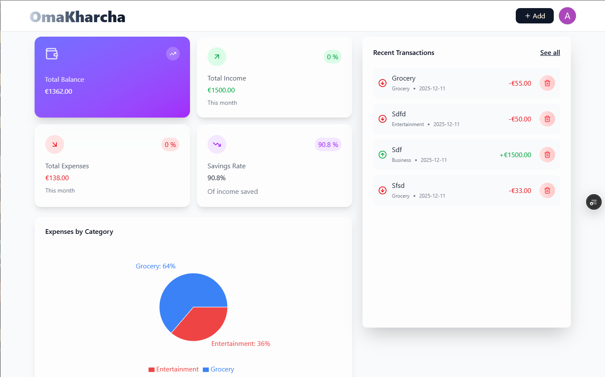
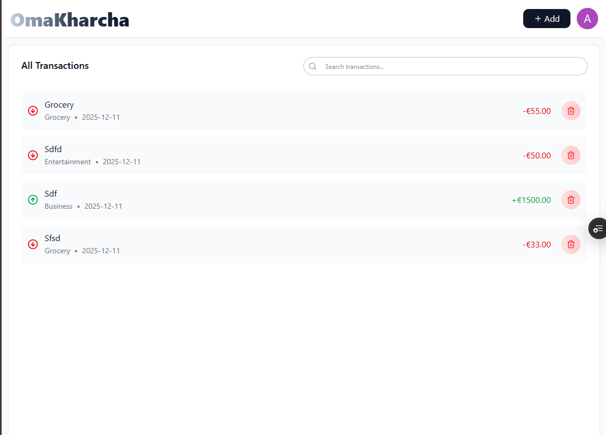
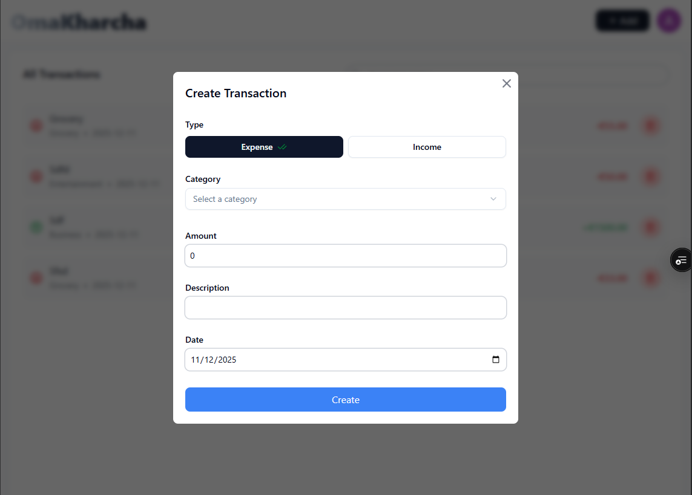

# 💰 OmaKharcha - Your Personal Expense Tracker

[](https://oma-kharcha.vercel.app)

OmaKharcha (Finnish for 'Own Expenses') is a modern, responsive web application designed to help you effortlessly track and manage your daily expenses and income. Keep a clear overview of your personal finances with a simple, intuitive interface.

## ✨ Features (Assumed)

* **Simple Expense Logging:** Quickly add new transactions (expenses and income).
* **Expense Categorization:** Organize your spending with various categories.
* **Summary Dashboard:** View a snapshot of your recent financial activity.
* **Data Persistence:** Securely store and manage your financial records.

## 🚀 Live Demo

Experience the application live here:
**[oma-kharcha.vercel.app](https://oma-kharcha.vercel.app)**

## 📸 Screenshots

### Dashboard Overview
<kbd>
    
</kbd>

### Transaction List Overview
<kbd>
    
</kbd>

### Add Expense Form
<kbd>
    
</kbd>

## 🛠️ Technology Stack

This project is built using the following modern web technologies:

* **Frontend Framework:** [Next.js](https://nextjs.org/) (App Router)
* **Language:** [TypeScript](https://www.typescriptlang.org/)
* **Styling:** Tailwind CSS (Likely, based on modern Next.js setup)
* **Database ORM:** [Prisma](https://www.prisma.io/)

## 💻 Getting Started

Follow these steps to set up and run the project locally.

### Prerequisites

* Node.js (LTS recommended)
* A database connection (configured for Prisma)

### Installation

1.  **Clone the repository:**
    ```bash
    git clone [https://github.com/APNpandit611/OmaKharcha.git](https://github.com/APNpandit611/OmaKharcha.git)
    cd OmaKharcha
    ```

2.  **Install dependencies:**
    ```bash
    npm install
    # or
    yarn install
    # or
    pnpm install
    ```

3.  **Setup Environment Variables:**
    Create a `.env` file in the root directory and add your database connection string and any other required variables (e.g., `DATABASE_URL`).

4.  **Run Prisma Migrations:**
    ```bash
    npx prisma migrate dev
    ```

5.  **Run the development server:**
    ```bash
    npm run dev
    # or
    yarn dev
    # or
    pnpm dev
    ```

Open [http://localhost:3000](http://localhost:3000) in your browser to see the application.
